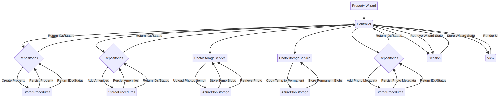
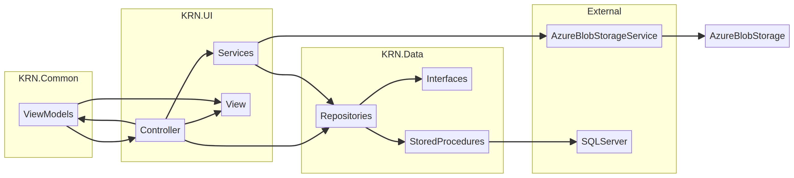

# Architecture Inspection & Refactoring Assessment for the Property Creation Workflow

## Objective

This report details a comprehensive architectural inspection of the existing Property creation workflow within the KasiRoomNetwork application. The primary objective is to understand the current implementation thoroughly and to propose a detailed implementation plan for migrating to a transaction-based architecture. This migration aims to enhance data integrity while preserving the current project structure and minimizing code modifications.

## Project Architecture Overview

The KasiRoomNetwork solution is structured into three main projects. The `KRN.Data` project contains data access logic, including repositories and interfaces. The `KRN.Common` project houses shared components such as ViewModels and common classes or enums. Finally, the `KRN.UI` project represents the presentation layer, including controllers and services.

The inspection adheres to the constraint of not introducing additional architectural projects, such as Domain, Core, or Entity projects, unless absolutely necessary, favoring the reuse of the existing architecture.

## Scope of Inspection

The inspection covers the complete Property creation workflow, from the UI interactions through to persistence in SQL Server and Azure Blob Storage. Key components inspected include the `PropertyController`, the `PostRoomWizardController` (which handles the existing PostRoomWizard), the `PropertyRepository`, the `AmenityRepository`, and the `AzureBlobStorageService`. The inspection also covers Dependency Injection configuration, ViewModels involved in the workflow, Stored Procedure usage, the current photo upload process, address creation, property photo metadata creation, and amenity persistence.

Additionally, the equivalent Listing (Room) creation workflow was inspected to identify reusable patterns and potential areas for shared logic.

## Deliverables

### 1. Current Request Flow

The Property creation workflow can be initiated via two main paths: the `PropertyController` for direct property creation or the `PostRoomWizardController` for a guided, multi-step process that creates both a Property and an associated Listing (Room).

#### PropertyController Flow

The `PropertyController` flow begins when a user initiates the `CreateProperty` GET action. The controller checks if the landlord's profile is complete. If not, it redirects to the profile completion page. Otherwise, it retrieves all amenities from the `IAmenityRepository` and prepares a `CreatePropertyViewModel` for the view.

When the user submits the `CreateProperty` POST action, the controller validates the `CreatePropertyViewModel`. If valid, it calls `_propertyRepository.CreateProperty` to persist the property details. If amenities are selected, it iterates through them, calling `_amenityRepository.AddPropertyAmenity` for each. Upon successful creation, it redirects to the `AddPropertyPhotos` action.

The `AddPropertyPhotos` GET and POST actions handle photo uploads. On POST, it calls `_photoStorageService.SaveOptimizedImageAsync` to upload the photo to Azure Blob Storage and then `_propertyRepository.AddPropertyPhoto` to save the photo metadata in the database. Error handling includes deleting the uploaded blob if repository persistence fails.

#### PostRoomWizardController Flow

This wizard guides the landlord through several steps to create a property and a listing (room) simultaneously. The wizard state is maintained in `HttpContext.Session`.

The process starts with the `Start` GET and POST actions, which initialize the wizard, clear old temporary photos and session state, and create a `PostRoomWizardStateViewModel`. The `BasicPropertyInfo` GET and POST actions collect basic property details, saving the state to the session. The `Address` GET and POST actions gather address information, which is also validated and saved to the session state. The `Amenities` GET and POST actions allow the landlord to select amenities, storing the chosen amenity IDs in the session state.

The `Photos` GET and POST actions manage the upload of temporary photos. The `_photoStorageService.SaveTemporaryPhotoAsync` method uploads images to a designated temporary container in Azure Blob Storage (`wizard-temp-images`). The temporary paths are recorded in the session state. Users can remove photos, triggering `_photoStorageService.DeleteTemporaryPhoto`.

The `RoomDetails` GET and POST actions capture specific details pertaining to the listing (room), validating and storing this information in the session. The `SelectRoomPhotos` GET and POST actions allow the landlord to select which of the previously uploaded temporary photos should be associated with the listing. The `UseForRoom` flag on `PostRoomUploadedPhotoViewModel` instances in the session state is updated accordingly.

The `ReviewAndSubmit` GET and POST actions represent the culmination of the wizard, where all collected data is persisted to the database and Azure Blob Storage. A `CreatePropertyViewModel` is constructed from the wizard state, and `_propertyRepository.CreateProperty` is called. Selected amenities are then added by iterating and calling `_amenityRepository.AddPropertyAmenity`. Temporary property photos are moved to permanent storage using `_photoStorageService.CopyTemporaryPhotoToPermanentAsync`, and their metadata is saved via `_propertyRepository.AddPropertyPhoto`. A `CreateListingViewModel` is built, and `_listingRepository.CreateListing` is invoked. Selected temporary listing photos are similarly copied to permanent storage, and their metadata is saved via `_listingRepository.AddListingPhoto`. Finally, the `HttpContext.Session` is cleared, and any remaining temporary wizard photos are deleted using `_photoStorageService.DeleteTemporaryWizardFolder`. A `CleanupFailedSubmitAsync` method is implemented to attempt a partial rollback (deleting created property/listing and associated permanent photos) if any part of the submission process encounters an exception.

Below is a visual representation of the Property Creation Request Flow:

### 2. Dependency Map

The following diagram illustrates the key components and their dependencies within the KasiRoomNetwork application, focusing on the Property creation workflow:

Controllers, such as `PropertyController`, `PostRoomWizardController`, and `ListingController`, are responsible for handling user requests, orchestrating business logic, and preparing data for views. They depend on Services (e.g., `IPhotoStorageService`), Repositories (e.g., `IPropertyRepository`, `IAmenityRepository`, `IListingRepository`), and ViewModels for data binding and presentation. They also interact with the View to render the user interface.

Services, like `AzureBlobStorageService`, encapsulate specific business logic or external integrations. For instance, `AzureBlobStorageService` directly interacts with Azure Blob Storage for file storage.

Repositories, including `PropertyRepository`, `AmenityRepository`, and `ListingRepository`, abstract data access operations. They implement Interfaces (e.g., `IPropertyRepository`) and rely on `ISqlDataAccess` for executing database commands. Their operations ultimately translate into calls to Stored Procedures, which interact with SQL Server.

ViewModels are plain data structures used to transfer data between the UI and the controllers, and sometimes between different layers of the application.

### 3. Repository Audit

| Repository | Responsibilities | Public Methods | SQL Responsibilities | Photo Metadata Responsibilities | Duplicate Responsibilities | Tight Coupling | Transaction Participation |
| :--- | :--- | :--- | :--- | :--- | :--- | :--- | :--- |
| `PropertyRepository` | Manages CRUD operations for `Property` entities, including creating properties, retrieving properties for editing, updating properties, deleting properties, and managing property photos. | `CreateProperty`, `GetPropertyForEditAsync`, `UpdatePropertyAsync`, `DeletePropertyAsync`, `GetPropertiesByUser`, `AddPropertyPhoto`, `GetPropertyById`, `GetPropertyPhotoCount`, `GetPropertyPhotos`, `DeletePropertyPhoto`, `SetPrimaryPropertyPhoto`. | All data operations delegate to `ISqlDataAccess` which executes stored procedures (e.g., `sp_Landlord_Create_Property`, `sp_Property_Add_Photo`). | Stores `PhotoPath`, `IsPrimary` status, and associates photos with `PropertyId` and `LandlordUserId`. | None identified within this repository itself, but its methods are called by both `PropertyController` and `PostRoomWizardController`. | Tightly coupled to `ISqlDataAccess` and specific stored procedure names. No explicit transaction management at the repository level; each method calls `_db.GetData` or `_db.SaveData` which creates a new `SqlConnection` for each operation. | Cannot directly participate in an externally managed SQL transaction due to the `ISqlDataAccess` implementation creating and disposing a new `SqlConnection` for each call. `sp_Landlord_Create_Property` and `sp_Property_Add_Photo` contain their own `BEGIN TRANSACTION`/`COMMIT TRANSACTION` blocks, making them atomic operations at the stored procedure level. |
| `AmenityRepository` | Manages `Amenity` data, primarily focusing on retrieving available amenities and associating them with properties. | `GetAllAmenities`, `GetAmenitiesByPropertyId`, `AddPropertyAmenity`, `RemovePropertyAmenity`, `UpdatePropertyAmenitiesAsync`. | Operations are executed via `ISqlDataAccess` and corresponding stored procedures (e.g., `sp_PropertyAmenity_Add`). | None. | None. | Similar to `PropertyRepository`, it is tightly coupled to `ISqlDataAccess` and specific stored procedures. The `UpdatePropertyAmenitiesAsync` method performs a clear-and-readd operation, which is a multi-step process that is not transactional at the repository level. | `AddPropertyAmenity`'s underlying stored procedure (`sp_PropertyAmenity_Add`) contains its own `BEGIN TRANSACTION`/`COMMIT TRANSACTION` block. However, `UpdatePropertyAmenitiesAsync` performs multiple `SaveData` calls in a loop, meaning if one fails, previous additions might persist, leading to data inconsistency. It cannot participate in an external transaction. |
| `ListingRepository` | Manages CRUD operations for `Listing` entities, including creating listings, retrieving listings, updating listings, deleting listings, and managing listing photos. | `CreateListing`, `AddListingPhoto`, `DeleteListing`, `GetListingById`, `GetListingDetailsById`, `GetListingPhotoCount`, `GetListingPhotos`, `DeleteListingPhoto`, `SetPrimaryListingPhoto`, `SearchListings`. | All data operations delegate to `ISqlDataAccess` which executes stored procedures (e.g., `sp_Listing_Create_Listing`, `sp_Listing_Add_Listing_Photo`). | Stores `PhotoPath`, `IsPrimary` status, and associates photos with `ListingId` and `LandlordUserId`. | None identified. | Tightly coupled to `ISqlDataAccess` and specific stored procedure names. No explicit transaction management at the repository level. | `sp_Listing_Add_Listing_Photo` contains its own `BEGIN TRANSACTION`/`COMMIT TRANSACTION` block. `sp_Listing_Create_Listing` does not have an explicit transaction block, but it's a single insert statement. Similar to other repositories, it cannot participate in an external transaction due to `ISqlDataAccess` implementation. |

### 4. Wizard Audit (`PostRoomWizardController`)

The wizard follows a sequential flow: Start -> BasicPropertyInfo -> Address -> Amenities -> Photos -> RoomDetails -> SelectRoomPhotos -> ReviewAndSubmit. The `PostRoomWizardStateViewModel` is stored in `HttpContext.Session` and updated at each step. This is crucial for maintaining state across HTTP requests.

Each step has `ModelState.IsValid` checks. If validation fails, the user is returned to the current step with error messages. Additionally, there are checks to ensure previous steps are completed before proceeding (e.g., `HasCompletedBasicPropertyInfo`).

For temporary storage, `_photoStorageService.SaveTemporaryPhotoAsync` uploads photos to a temporary Azure Blob Storage container (`wizard-temp-images`). The paths are stored in the session state. Navigation between steps is achieved using `RedirectToAction` to move between GET actions for each step.

The `ReviewAndSubmitPost` action orchestrates the persistence of property, amenities, and listing data, including copying temporary photos to permanent storage and saving photo metadata. It includes a `CleanupFailedSubmitAsync` method for partial rollback in case of errors.

The multi-step flow, session-based state management, and the `PostRoomWizardStateViewModel` are good candidates for reuse. The UI structure for each step is also reusable. However, the current submission process in `ReviewAndSubmitPost` is a series of independent repository calls. This needs to be refactored to use a single, externally managed transaction to ensure atomicity across property, amenity, and listing creation, as well as photo metadata persistence. The overall wizard structure, individual step views, and client-side validation logic can largely remain as is.

### 5. ViewModel Audit

The current ViewModels include `CreatePropertyViewModel`, `EditPropertyViewModel`, `PropertyDetailsViewModel`, `CreateListingViewModel`, `ListingDetailsViewModel`, `PostRoomWizardStateViewModel`, `PostRoomBasicPropertyInfoStepViewModel`, `PostRoomAddressStepViewModel`, `PostRoomAmenitiesStepViewModel`, `PostRoomUploadedPhotoViewModel`, `PostRoomDetailsStepViewModel`, and `PostRoomReviewStepViewModel`.

There is some data duplication between `CreatePropertyViewModel` and `PostRoomWizardStateViewModel` (which contains nested step-specific ViewModels). `PostRoomWizardStateViewModel` aggregates data from various steps before final submission.

The current ViewModels seem to capture all necessary information for the respective operations. However, for a transaction-based approach, a dedicated DTO (Data Transfer Object) might be beneficial to encapsulate all data required for a single atomic operation, rather than relying on session state and multiple ViewModel properties. An additional DTO that aggregates all property, address, amenity, and listing details, along with photo paths, would be beneficial for the service layer to perform a single transactional operation. This would decouple the service from the UI-specific ViewModels.

Currently, controllers directly map ViewModel properties to repository method parameters. With a new DTO, this mapping would shift to the service layer, which would map the aggregated DTO to repository calls.

**Recommended improvements**: Introduce a dedicated `PropertyListingCreationDto` (or similar) that encapsulates all data needed for the atomic creation of a property and its associated listing, amenities, and photo metadata. This DTO would be passed to a new service layer method.

### 6. Azure Blob Storage Audit (`AzureBlobStorageService`)

The `SaveTemporaryPhotoAsync` method handles temporary uploads to the `wizard-temp-images` container. The `SaveOptimizedImageAsync` method handles direct permanent uploads for non-wizard flows to `property-images` or `listing-images` containers. Both validate file size and extension, and optimize images (resize, compress) before uploading.

The `DeleteTemporaryPhoto`, `DeleteTemporaryPhotos`, `DeleteLandlordTemporaryPhotos`, and `DeletePhoto` methods are available for deleting individual blobs or entire temporary folders. The `CleanupExpiredTemporaryPhotos` method runs periodically to remove old temporary blobs.

Methods include `try-catch` blocks to log errors, but blob operations themselves are not transactional with database operations. If a photo is uploaded to Azure but its metadata fails to persist in SQL, the blob remains in storage unless explicitly cleaned up.

Upload methods return the URI string of the uploaded blob. Delete methods are `void` or return `bool` for existence checks. The full URI of the uploaded blob is returned, which includes the container and blob name. This URI is then stored in the database as `PhotoPath`.

The `PostRoomWizardController.CleanupFailedSubmitAsync` method attempts to delete permanent photos if the overall wizard submission fails. However, this is a manual cleanup step. A more robust solution would integrate blob operations into a distributed transaction or use a compensation pattern. The current `CopyTemporaryPhotoToPermanentAsync` explicitly avoids deleting the source temporary blob to allow reuse, which is a good practice but means temporary blobs persist until the `WizardTempCleanupHostedService` runs or `DeleteTemporaryWizardFolder` is explicitly called.

### 7. Transaction Readiness Assessment

The stored procedures `sp_Landlord_Create_Property`, `sp_Property_Add_Photo`, `sp_PropertyAmenity_Add`, and `sp_Listing_Add_Listing_Photo` all contain their own `BEGIN TRANSACTION`/`COMMIT TRANSACTION` blocks. This means they are atomic operations at the stored procedure level.

The `ISqlDataAccess` interface and its implementation `SqlDataAccess` do not provide overloads to accept an existing `IDbConnection` or `IDbTransaction`. This is the critical missing piece. To support external transaction management, `GetData` and `SaveData` methods in `ISqlDataAccess` would need overloads that accept `IDbTransaction` as a parameter, allowing a service layer to manage a single transaction across multiple repository calls.

Repository methods that perform single, isolated read operations (e.g., `GetPropertyById`, `GetAllAmenities`) do not necessarily need to participate in a transaction, unless strong read consistency is required within a larger transactional context.

The preferred architecture is for a **service layer** to own the transaction. This service would orchestrate multiple repository calls (e.g., `CreateProperty`, `AddPropertyAmenity`, `CreateListing`, `AddListingPhoto`) within a single `IDbTransaction`. Repositories would then participate in this transaction by using the `IDbTransaction` passed to them.

### 8. Data Integrity Audit

| Scenario | Cause | Risk | Severity | Recommended Solution |
| :--- | :--- | :--- | :--- | :--- |
| Property created but amenities missing | `PropertyController.CreateProperty` or `PostRoomWizardController.ReviewAndSubmitPost` successfully calls `_propertyRepository.CreateProperty`, but an exception occurs during the loop calling `_amenityRepository.AddPropertyAmenity`. | Incomplete property data, potentially leading to incorrect search results or display issues. | Medium | Implement a service layer that wraps the property creation and amenity additions in a single SQL transaction. |
| Property created but address missing | This is currently mitigated because `sp_Landlord_Create_Property` handles both Address and Property insertion within its own transaction. | N/A | Low | Maintain the current stored procedure logic, but ensure it participates in the broader service-level transaction. |
| Property created but photos missing | `PropertyController.AddPropertyPhotos` uploads the blob successfully, but `_propertyRepository.AddPropertyPhoto` fails. Or, in the wizard, property creation succeeds, but photo copying or metadata insertion fails. | Property displayed without photos, degrading user experience. | Medium | For the wizard, include photo metadata insertion in the service-level transaction. For direct uploads, implement a compensation mechanism to delete the blob if metadata insertion fails (currently partially implemented in `PropertyController`). |
| Blob uploaded but metadata missing | Similar to above, the blob is in Azure, but no record exists in SQL. | Orphaned blobs consuming storage space and incurring costs. | Low | Implement a robust compensation mechanism or a background job to identify and clean up orphaned blobs. |
| Duplicate submissions | User double-clicks the submit button, or network issues cause retries. | Duplicate properties or listings created. | Medium | Implement idempotency keys or unique constraints in the database. Add UI-level protections (e.g., disabling the submit button after click). |
| Network interruption | Connection lost between the application and SQL Server or Azure Blob Storage during a multi-step process. | Partial data persistence, leading to inconsistent state. | High | Rely on the service-level SQL transaction to rollback database changes. Implement compensation logic for Blob Storage operations. |
| SQL exception during creation | A database constraint violation or other SQL error occurs during one of the repository calls. | Partial data persistence if not wrapped in a transaction. | High | The service-level SQL transaction will automatically rollback all database changes made within its scope. |

### 9. UI Impact Assessment

The current Property creation UI, including the wizard, is generally well-structured. The views themselves do not require significant modification to support the architectural changes, as the changes are primarily backend-focused.

The JavaScript used for client-side validation and dynamic UI updates can be reused without modification. The existing validation logic, both client-side and server-side (via DataAnnotations on ViewModels), remains applicable.

The current wizard flow is logical and user-friendly, so it can remain. However, the final submission step (`ReviewAndSubmit`) might benefit from a loading indicator or a more robust error handling display, as the backend process will now involve a more complex transactional operation.

Additional review or loading screens are not strictly necessary, but enhancing the user feedback during the final submission process is recommended to improve the user experience, especially if the transactional operation takes slightly longer.

### 10. Shared Workflow Analysis

Both Property creation and Listing (Room) creation involve similar patterns:
1.  Collecting basic information (Property details vs. Room details).
2.  Associating amenities (Property amenities).
3.  Uploading and managing photos (Property photos vs. Listing photos).
4.  Persisting data to SQL Server and Azure Blob Storage.

These shared patterns present opportunities for reuse. For example, a generic photo upload and management service could be created to handle both property and listing photos, reducing code duplication. Similarly, a generic transaction management approach could be applied to both workflows, ensuring data integrity across the board.

### 11. Proposed Architecture

Based on the inspection, the recommended architecture aims to improve data integrity while preserving the existing solution structure and minimizing refactoring.

The core of the proposed architecture is the introduction of a **Service Layer** (e.g., `PropertyCreationService`) responsible for orchestrating the creation workflow and managing transactions.

**Key Components:**

*   **`ISqlDataAccess` Enhancement**: Modify `ISqlDataAccess` and `SqlDataAccess` to support passing an `IDbTransaction`. This could involve adding overloaded methods (e.g., `GetDataAsync<T>(string spName, object parameters, IDbTransaction transaction)`) or creating a unit-of-work abstraction.
*   **Repository Updates**: Update repository interfaces and implementations to accept an optional `IDbTransaction` parameter in their methods. This allows them to participate in a transaction managed by the service layer.
*   **`PropertyCreationService`**: This new service will act as the orchestrator. Its responsibilities include:
    *   Receiving a comprehensive DTO (e.g., `PropertyListingCreationDto`) containing all necessary data.
    *   Initiating a database transaction via `ISqlDataAccess`.
    *   Calling the appropriate repository methods (e.g., `CreateProperty`, `AddPropertyAmenity`, `CreateListing`, `AddListingPhoto`) within the transaction scope.
    *   Committing the transaction if all operations succeed.
    *   Rolling back the transaction if any operation fails.
    *   Coordinating with `IPhotoStorageService` to handle blob operations (copying temporary photos to permanent storage) and implementing compensation logic (deleting permanent blobs) if the database transaction fails.

This architecture leverages Dapper and Stored Procedures as currently implemented, but wraps the calls in a managed transaction to ensure atomicity. It reuses the existing repositories and `AzureBlobStorageService`, minimizing disruption to the codebase.

### 12. Migration Plan

The migration to the transaction-based architecture can be executed in the following phases:

**Phase 1: Infrastructure Enhancement (Low Complexity)**
*   Modify `ISqlDataAccess` and `SqlDataAccess` to support `IDbTransaction`.
*   Update repository interfaces and implementations to accept an optional `IDbTransaction` parameter.

**Phase 2: Service Layer Implementation (Medium Complexity)**
*   Create the `PropertyListingCreationDto`.
*   Implement the `PropertyCreationService` with transaction management and orchestration logic.
*   Integrate `IPhotoStorageService` into the service for blob management and compensation.

**Phase 3: Controller Refactoring (Medium Complexity)**
*   Refactor `PropertyController` and `PostRoomWizardController` to use the new `PropertyCreationService` instead of calling repositories directly.
*   Update the controllers to map ViewModels to the new DTO.

**Phase 4: Testing and Validation (High Complexity)**
*   Thoroughly test the new workflow, focusing on error scenarios and transaction rollbacks.
*   Verify that data integrity is maintained and that blob storage is correctly managed (no orphaned blobs).

### 13. Files Impact Report

| File | Impact | Reason |
| :--- | :--- | :--- |
| `KasiRoomNetwork.Data/DataAccess/ISqlDataAccess.cs` | Modify | Add overloads to support `IDbTransaction`. |
| `KasiRoomNetwork.Data/DataAccess/SqlDataAccess.cs` | Modify | Implement the new overloads to support `IDbTransaction`. |
| `KasiRoomNetwork.Data/Interfaces/IPropertyRepository.cs` | Modify | Add optional `IDbTransaction` parameter to relevant methods. |
| `KasiRoomNetwork.Data/Repositories/PropertyRepository.cs` | Modify | Implement the updated interface methods to use the provided transaction. |
| `KasiRoomNetwork.Data/Interfaces/IAmenityRepository.cs` | Modify | Add optional `IDbTransaction` parameter to relevant methods. |
| `KasiRoomNetwork.Data/Repositories/AmenityRepository.cs` | Modify | Implement the updated interface methods to use the provided transaction. |
| `KasiRoomNetwork.Data/Interfaces/IListingRepository.cs` | Modify | Add optional `IDbTransaction` parameter to relevant methods. |
| `KasiRoomNetwork.Data/Repositories/ListingRepository.cs` | Modify | Implement the updated interface methods to use the provided transaction. |
| `Kasi Room Network - KRN/Controllers/PropertyController.cs` | Modify | Refactor to use the new `PropertyCreationService`. |
| `Kasi Room Network - KRN/Controllers/PostRoomWizardController.cs` | Modify | Refactor to use the new `PropertyCreationService`. |
| `Kasi Room Network - KRN/Services/PropertyCreationService.cs` | Create | New service to orchestrate the creation workflow and manage transactions. |
| `Kasi Room Network - KRN/Services/IPropertyCreationService.cs` | Create | Interface for the new service. |
| `KasiRoomNetwork.Common/DTOs/PropertyListingCreationDto.cs` | Create | New DTO to encapsulate data for the service layer. |
| `Kasi Room Network - KRN/Services/AzureBlobStorageService.cs` | Unchanged | The existing implementation is sufficient; the service layer will handle compensation logic. |
| `Database/KasiRoomNetworkDB SCRIPT_DEVELOPMENT.sql` | Unchanged | Existing stored procedures can be reused; the transaction management will happen at the application layer. |
| ViewModels (`CreatePropertyViewModel`, etc.) | Unchanged | Existing ViewModels can be reused for UI binding. |
| Views (`CreateProperty.cshtml`, etc.) | Unchanged | UI remains the same. |
